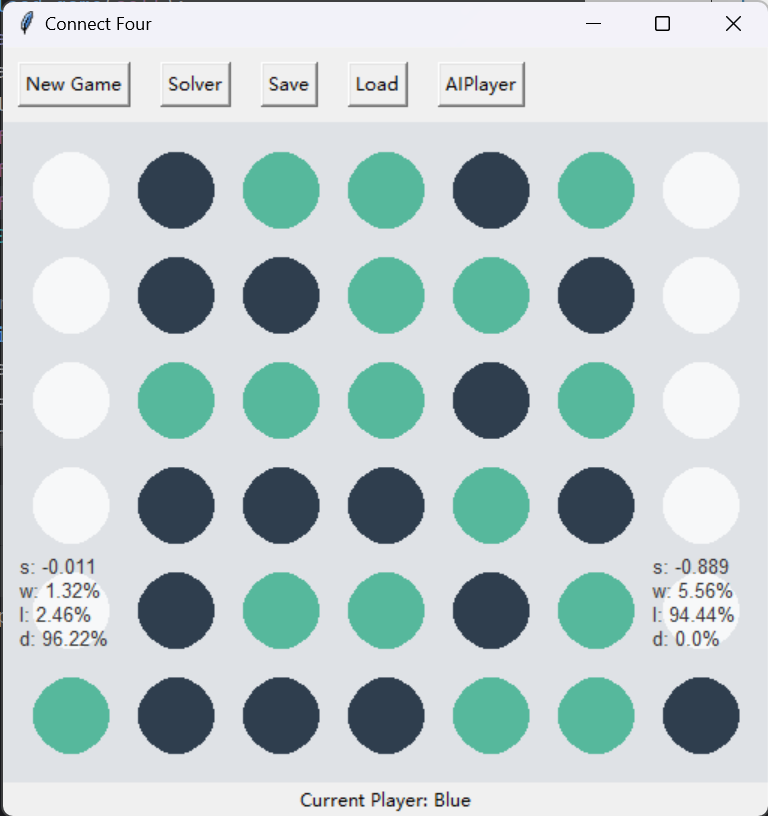

HOW TO RUN THE PROGRAMME

1. run main.py
2. click _**load**_ button to load a game
3. click _**solver**_ button to run the MCTS

Here $a$ represents action, $n$ represents simulation time and $p$ represents average score.
4. 